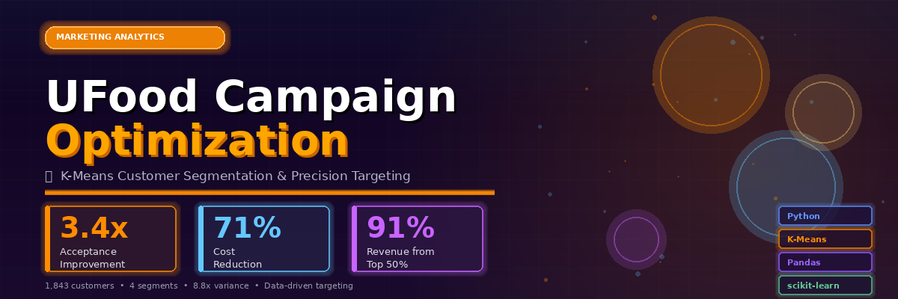

# UFood Marketing Campaign Optimization

<div align="center">


**Achieving 3.4x Campaign Acceptance Improvement Through Precision Customer Segmentation**

[](https://github.com/TimothyTshimauswu/UFood-Marketing-Campaign-Optimization/tree/main/notebooks)
[](https://github.com/TimothyTshimauswu/UFood-Marketing-Campaign-Optimization#readme)

</div>



**Tools**: Python | Pandas | Scikit-learn | K-Means | Matplotlib | Seaborn  
**Impact**: 3.4x improvement in campaign acceptance through customer segmentation

-----

## The Problem

UFood is Brazil’s leading food delivery app. Their marketing campaigns were hemorrhaging money:

- Mass-targeting all 1,843 customers
- 15% campaign acceptance rate
- ROI: -98.8%
- No segmentation strategy

They were treating a 40-year-old parent buying basics the same as a high-income professional ordering premium wine. This needed to change.

-----

## What I Did

### Part 1: Exploratory Analysis

Analyzed 1,843 customers across 29 features to find what actually drives campaign acceptance and spending.


**What I found:**

**Age matters, but not how you’d think**: U-shaped acceptance pattern. Younger (23-30) and older (71-85) customers respond well to campaigns, but the 41-70 group drives most revenue despite lower acceptance. Classic tension between who responds and who spends.

**Household size is the real driver**: Strong negative correlation with both acceptance and spending. Customers with 0-1 children engage more and spend more. As kids increase, both metrics drop sharply. Makes sense - less disposable income, less time to browse catalogs.


**Catalog is a premium channel**: Low usage across the base, but campaign acceptors use it heavily. Not a volume play, it’s a high-value customer indicator.

**Education and marital status don’t matter**: Flat acceptance rates across education levels. Marital status shows no propensity differences, just size effects. Excluded both from modeling.


**Bottom line from EDA**: Target higher-income customers with fewer children. Catalog for premium segments, digital for everyone else.

-----

### Part 2: K-Means Clustering

Used K-Means to segment customers based on demographics, spending, channels, and campaign history. Selected 17 features informed by EDA findings.

Tested k=2 to k=10. Chose k=4 for interpretability - silhouette score 0.240.


-----

## Results

### Four Clear Segments


|Segment      |Customers|Avg Spend |Acceptance|Revenue|Profile                       |
|-------------|---------|----------|----------|-------|------------------------------|
|**Cluster 0**|448 (24%)|R107      |8%        |5%     |Low-income families, 1.65 kids|
|**Cluster 1**|484 (26%)|R747      |32%       |35%    |Mid-income, 1.08 kids         |
|**Cluster 2**|446 (24%)|**R1,322**|**73%**   |**57%**|High-income, 0.19 kids        |
|**Cluster 3**|465 (25%)|R91       |10%       |4%     |Budget families, 0.90 kids    |


### What This Means

**The 80/20 rule in action**: Cluster 2 is 24% of customers but 57% of revenue. Meanwhile, Clusters 0+3 are 50% of customers but only 9% of revenue.

**Acceptance varies 8.8x**: From 8% (Cluster 0) to 73% (Cluster 2). Current mass-targeting averages this to 15%, missing the 73% potential entirely.

**EDA hypothesis confirmed**: Cluster 2 has 0.19 children (basically childless), R76K income, and loves catalog (6.0 purchases vs 0.6-0.7 for others). Exactly what the exploratory analysis predicted.

**Product preferences are clear**: Cluster 2 spends R604 on wine (47% of budget) and R472 on meat (35%). Premium tastes. Cluster 3 spends R38 on wine total. Different worlds.


-----

## Recommendations

### Stop Mass-Targeting

**Target Clusters 1+2 (930 customers)**:

- 91% of revenue
- 32-73% acceptance rates
- Worth the investment

**Web-only for Clusters 0+3 (913 customers)**:

- 9% of revenue
- 8-10% acceptance
- Not worth expensive campaigns

### Channel Strategy

**Catalog**: Cluster 2 only (446 customers, 73% acceptance). Eliminate 1,397 catalog mailings. Cost reduction: 71%.

**Digital**: Clusters 1+2. Cost-efficient for moderate responders.

**In-store**: Universal baseline. Focus premium promotions on Clusters 1+2.

### Product Focus

Cluster 2: Wine and meat offers (R604 and R472 avg spend). Premium positioning.

Cluster 1: Balanced variety. Loyalty programs.

Clusters 0+3: Discounts only. Keep it cheap.

### Expected Outcomes

- Acceptance: 15% → 52% (weighted across Clusters 1+2)
- Customers targeted: 1,843 → 930 (cut waste)
- Campaign cost: -71% (stop mailing catalogs to non-responders)
- Response volume: 276 → 480 (+74% with 50% fewer people)

-----

## Implementation

**Month 1**: Stop catalog to Clusters 0+3. Immediate 71% cost reduction.

**Month 2-3**: Deploy targeted catalog to Cluster 2, digital to Cluster 1. Monitor acceptance.

**Month 4+**: Refine offers based on response. Build retention programs for Cluster 2.

Track: Acceptance rate by segment, cost per acquisition, Cluster 2 retention.

-----

## Technical Details

**Data prep**: Cleaned 1,843 records, engineered features (total children, spending aggregations), encoded categoricals.

**EDA**: Correlation analysis, age/household segmentation, channel comparison.

**Clustering**: StandardScaler, K-Means with k=4, validated against business metrics.

**Stack**: pandas, numpy, scikit-learn, matplotlib, seaborn

-----

## Repository

```
UFood-Marketing-Campaign-Optimization/
├── README.md
├── data/
│   └── u_food_marketing_cleaned.csv
├── notebooks/
│   ├── 01_UFood_EDA_Analysis.ipynb
│   └── 02_UFood_KMeans_Clustering.ipynb
├── assets/
│   └── [9 visualization images]
└── outputs/
    └── ufood_with_clusters.csv
```

-----

## What I Learned

**EDA drives everything**: The household size insight from exploration directly informed feature selection and was validated in Cluster 2 (0.19 children, R1,322 spend, 73% acceptance).

**Averages lie**: 15% aggregate acceptance hides 8% to 73% variation. Segmentation reveals the truth.

**Catalog is a signal, not just a channel**: High catalog usage predicts high value. Cluster 2’s 6.0 purchases vs 0.6 for others makes targeting obvious.

**50/50 doesn’t mean 50/50**: Half the customers generate 9% of revenue. Equal investment is waste. Focus where it matters.

-----

## Contact

**Unarine Timothy Tshimauswu**  
Data Scientist | Marketing Analytics

[Email](mailto:timothytshimauswu@gmail.com) | [LinkedIn](https://www.linkedin.com/in/utshimauswu) | [Portfolio](https://timothy-ai-ml-portfolio-landing.vercel.app/)


-----

*Marketing analytics portfolio project: EDA, customer segmentation, K-Means clustering, campaign optimization strategy*
